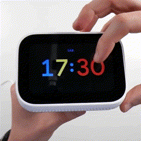
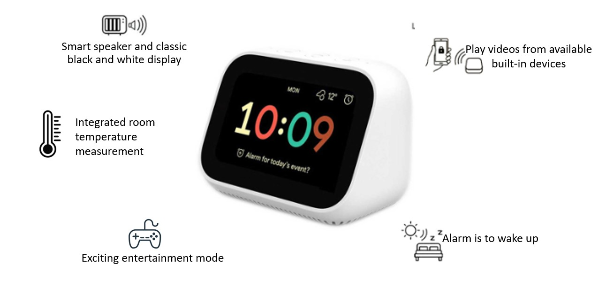

  

    
    
    
    

Smart Desk Clock is our next generation product that brings smart solutions to manage time and provide entertainment services available on the device

## Learn More about Smart Desk Clock 
 

  

## Table of Contents
- [Learn More about Smart Desk Clock](#learn-more-about-smart-desk-clock)
- [Table of Contents](#table-of-contents)
- [Technologies](#technologies)
- [Features](#features)
- [Usage](#usage)
- [Contributing](#contributing)
- [License](#license)
- [Demo Smart Desk Clock](#demo-smart-desk-clock)

## Technologies
 

  

* **STM32 Microcontroller**: The project is based on the STM32 microcontroller platform, which offers a wide range of microcontrollers with different performance levels and features.
*  **STM32CubeIDE**: The project was developed using popular IDEs which is STM32CubeIDE, provide tools for code development, debugging, and firmware deployment.
*  **Communication Protocols**: The project includes the implementation of communication protocols such as UART, I2C, SPI, and wireless protocols like BLE .
*  **Peripheral Libraries**: The project utilizes peripheral libraries provided by the microcontroller manufacturer or third-party libraries to simplify the integration and configuration of peripherals.
*  **Other Device**: We intergrated a lot of device to increase experiment of customer and performance of device .
*  See our [document](./feature_of_project.md), [system architecture](./firmware_layer_interact.pu) and [system design](./Project.drawio) for more details .

## Features
 

  

The SmartDeskClock includes Includes new capabilities such as:

1. **Time and Temperature Display**: The clock will display the time (hours, minutes, seconds) and date on the screen along with the ambient temperature.

2. **Reminders and Notifications**: The clock can set timers, countdowns, reminder, and provide audio and RGB LED notifications when the specified time is reached.

3. **Entertainment**: Users can enjoy playing some simple built-in games on the clock, such as snake game.

4. **Computer Interaction Capability**: Users can interact with the clock through a computer to set the time, and perform firmware updates.
5. **Connect to other Device**: Smart Desk Clock can connect to other available devices for real-time video sharing .
6. Read our [release note](./RELEASE_NOTE.md) for more details and Look forward to other exciting features in the future . 

## Usage
1. Clone the project repository from [GitHub ↗](https://github.com/quynhle-dev/Smart-Desk-Clock-).
2. Set up your development environment with the required IDE (STM32CubeIDE) and toolchain and open the project in the chosen IDE.
3. Read our [diagram](./wire_connection.png) to connect the necessary peripherals or sensors to the STM32 microcontroller.
4. Deploy the firmware to the STM32 microcontroller using the appropriate flashing method (e.g., ST-Link, DFU, or bootloader).

## Contributing
We welcome contributions to this project! To ensure a smooth contribution process, please follow the guidelines below:

1. Make sure you have read and understood the Contribution Guide before getting started.
2. Check the Issues to see if there are any existing issues or requested features.
3. Create a new branch from main to work on your new feature: git checkout -b new-feature.
4. Make the necessary changes, additions, or bug fixes in the source code.
5. Double-check the code to ensure there are no errors and that it follows the coding guidelines.
6. Create a Pull Request with a detailed description of the changes you have made.
7. Wait for feedback and make any requested changes from the code reviewer.
8. Once your Pull Request is approved, thank you for your contribution and support!
* **Note**: Contributions to this project are welcome. If you find any issues or have suggestions for improvements, please submit a pull request or open an issue on the project's [GitHub repository](https://github.com/quynhle-dev/Smart-Desk-Clock-) or contact us [quynh-dev](https://github.com/quynhle-dev).

## License
This project is licensed under the [ISO/27001 License](https://www.iso.org/standard/27001). Please see the LICENSE file for more details.

## Demo Smart Desk Clock 
Below are a few typical features of Smart Desk Clock 

[Link Demo](https://www.youtube.com/watch?v=Lgt1foWSNBM)
