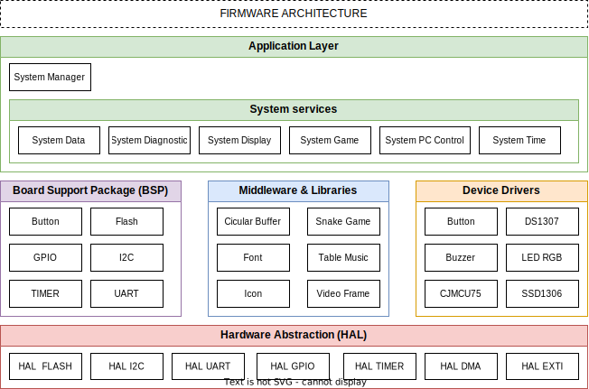

# Smart Desk Clock

## Purpose

The purpose of the Smart Desk Clock project is to create a convenient and intelligent smart desk clock. The project aims to combine smart features to provide more than just time information. The clock will be equipped with additional features such as notifications, sound adjustment, ambient temperature display, and the ability to interact with the user through an OLED screen and control buttons.

## Features

The SmartDeskClock project includes the following features:

1. **Time and Temperature Display**: The clock will display the time (hours, minutes, seconds) and date on the screen along with the ambient temperature.

2. **Reminders and Notifications**: The clock can set timers, countdowns, reminder, and provide audio and RGB LED notifications when the specified time is reached.

3. **Entertainment**: Users can enjoy playing some simple built-in games on the clock, such as snake game.

4. **Computer Interaction Capability**: Users can interact with the clock through a computer to set the time, and perform firmware updates.

## Required Modules

| Module      | Functionality                                     |
| ----------- | ------------------------------------------------- |
| STM32F411RE | Main microcontroller for the clock                |
| DS1307      | Real-time clock module for timekeeping            |
| SSD1306     | Display module for showing information            |
| CJMCU75     | Temperature sensor module for ambient temperature |
| BUTTON      | User interaction module for input                 |
| BUZZER      | Audio module for notifications                    |
| LED RGB     | Status indicator lights for the clock             |

## Detailed Features
1. **Time and Temperature Display**
   
| ID  | Functionality                  | Note                                                                 |
| --- | ------------------------------ | -------------------------------------------------------------------- |
| 01  | Display Current Time On Screen | Display Year, Month, Day of Week, Day of Month, Hour, Minute, Second |
| 02  | Theme                          | Change background (Dark mode, Light mode) and font                   |
| 03  | Display Temparature            | Tempereture in Celsius                                               |

2. **Reminders and Notifications**

| ID  | Functionality | Note                                                                                         |
| --- | ------------- | -------------------------------------------------------------------------------------------- |
| 01  | Setting Time  | Set Year, Month, Day of Week, Day of Month, Hour, Minute, Second                             |
| 02  | Alarm         | Set alarm time, choose type of event to trigger sound and LED blinking                       |
| 03  | Countdown     | Set a duration of time to countdown, triggers sound and LED blinking when the countdown ends |
| 04  | Stopwatch     | Start the stopwatch by pressing a button, press again to stop and display the elapsed time   |

3. **Entertainment**

| ID  | Functionality | Note                                                             |
| --- | ------------- | ---------------------------------------------------------------- |
| 01  | Snake Game    | User can use buttons to control snake eat food and get the score |

4. **Computer Interaction Capability**
   
| ID  | Functionality             | Note                                                                    |
| --- | ------------------------- | ----------------------------------------------------------------------- |
| 01  | Control clock use command | User can use COM app on PC to set time, reminder, song, led, theme, ... |
| 02  | Stream Video              | User can display video from camera via UART                             |

## Firmware Architecture

## Developer Team
1. **Tran Ngoc Hieu**
2. **Le Van Manh Quynh**
3. **Le Van Quy**
